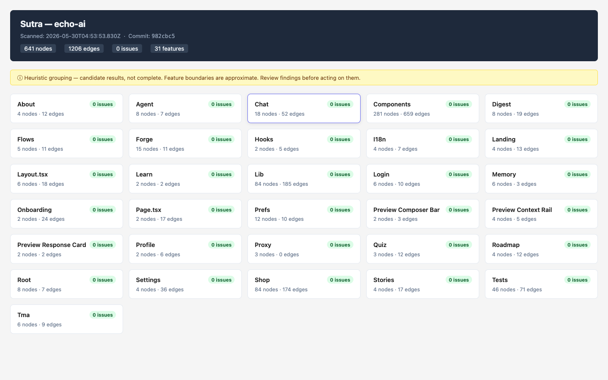

# Sutra

Static structural graph tool for JavaScript / TypeScript repositories. Points at a repo, produces a structural flow graph (`graph.json`) and a local HTML view. **v1.0.0** — Phases 0–7 complete.



## Vision

> **See your product as features — derived from code, not from docs, and honest about what it doesn't know.**

- **Truthful by default.** Every finding is labelled *candidate* until it's actually confirmed (cross-repo, dynamic routes, and external hosts resolved). No "finds all bugs", no overstated claims — structural/contract drift only.
- **Features, not files.** The unit is a *feature*: what it is, what it wires to, whether the wiring is intact, and where it's broken — with a health score you can click into.
- **A realistic feature viewer.** An interactive local viewer — feature cards, request-flow drill-down, a cross-repo map, and live refresh on code change — so you learn something true-and-new about your codebase in seconds.

## Roadmap

Full plan (4 epics, 23 stories, sequencing, and Definition of Done) lives here:
**[`_bmad/ROADMAP.md`](https://github.com/sbknext/forge-sutra/blob/main/_bmad/ROADMAP.md)**
· browse every story in the **[plan index](https://github.com/sbknext/forge-sutra/blob/main/_bmad/README.md)**.

- **Epic 1 — Truthful Graph:** external-host allowlist, dynamic-route matcher, confidence model, cross-repo linking, incremental scan, scan diff.
- **Epic 2 — Real Features:** feature contracts, client↔server reconciliation, AI inference, health score, flow tracing, test-coverage mapping.
- **Epic 3 — Realistic Feature Viewer ⭐:** viewer app, feature cards, drill-down, cross-repo map, live/watch, search & share.
- **Epic 4 — Ecosystem & SDK:** language-agnostic core, Python/Frappe extractor, Forge SDK extraction, CI integration, graph history.

**Try it:** `forge-sutra scan /path/to/repo && forge-sutra view` — then watch the roadmap as the static view grows into the full feature viewer. Issues and PRs welcome.

## Install

Primary npm bin: **`forge-sutra`**. Optional alias: **`sutra`** (same entry point).

```bash
npm install -g forge-sutra
# or from source:
npm run build && npm link
```


## Commands

All commands work via `forge-sutra` or `sutra`. Examples below use `forge-sutra`.

### `forge-sutra scan [repoPath]`

Scans `repoPath` (defaults to current working directory). Resolves to an absolute path.

Produces `.sutra/graph.json` in the current working directory.

```
forge-sutra scan /path/to/my-repo
forge-sutra scan   # uses cwd
sutra scan         # alias — same command
```

Options:
- `--watch` — debounced re-scan on TS/JS file changes. Snapshots previous graph to `.sutra/graph.prev.json`, writes `.sutra/diff.json`, prints delta summary. Ctrl+C to stop. Static scan only — not a runtime monitor.
- `--profile` — print phase timings (walk, parse, checks, write) to stderr. Candidate timings only — environment-dependent, not an SLA.

What it does:
1. Walks the repo (skips `node_modules`, `dist`, `.next`, `.git`, `coverage`, `out`).
2. Parses every `.ts`, `.tsx`, `.js`, `.jsx` file with ts-morph (AST-based, never regex).
3. Emits nodes for: modules, endpoints (Next.js App Router + pages/api + Express), components, functions, handlers, tests.
4. Emits edges for: imports, calls, renders (JSX), tests (test-file → subject), http (fetch/axios).
5. Parses `feature.sutra.md` contract files when present.
6. Runs structural + contract checks (see below).
7. Groups nodes into heuristic features by directory prefix.
8. Writes `.sutra/graph.json`.
9. Prints a one-screen summary to stdout.

### `forge-sutra view`

Reads `.sutra/graph.json` written by `scan`. Produces `.sutra/view.html` (a self-contained HTML document with Mermaid diagrams and issue lists). If `.sutra/diff.json` exists, shows a "Changes since last scan" panel. Opens it in the default browser on macOS; prints the file path on other platforms.

```
forge-sutra view
```

### `forge-sutra diff [pathA] [pathB]`

Diff two `graph.json` files. Defaults: `.sutra/graph.json` vs `.sutra/graph.prev.json`.

```
forge-sutra diff
forge-sutra diff .sutra/graph.json .sutra/graph.prev.json
forge-sutra diff graph-a.json graph-b.json --out .sutra/diff.json
```

Output: structured JSON (nodes/edges/issues added/removed/changed) + human counts line. Structural delta only — does not explain why code changed.

### `forge-sutra scaffold [--from-issues <kinds>] [--force]`

Emit **candidate** test stubs from graph issues into `.sutra/scaffold/`. Each file has a `// CANDIDATE — generated by Sutra, not run automatically` banner. Never overwrites existing files without `--force`.

```
forge-sutra scaffold
forge-sutra scaffold --from-issues orphaned_endpoint
forge-sutra scaffold --from-issues contract_missing_route --force
```

Stubs may not compile. Not run in CI. Not auto-test generation.

### `forge-sutra reconcile --client <graph> --server <graph>`

Match client graph HTTP calls against server graph routes. Emits `cross_repo_orphan` (warn) for client calls with no matching server route.

```
forge-sutra reconcile --client .sutra/all/echo-ai.json --server .sutra/all/brain-api.json
```

Cross-repo static match only — ignores auth, env-specific URLs, proxy rewrites, runtime 404s. Results are **candidates for human review**. Known proxy paths (e.g. echo-ai → brain-api via `next.config` rewrites) may still require manual verification.

### `forge-sutra migrate [graphPath]`

Migrate a saved `graph.json` to the current schema version. Default: `.sutra/graph.json`.

```
forge-sutra migrate
forge-sutra migrate .sutra/graph.json
```

Migrates **structure only** — does not re-scan or fix semantic issues.

**Version history:**

| Version | Change |
|---------|--------|
| 0 | Phase 0 schema (no `contracts` field) |
| 1 | Added `contracts[]` from `feature.sutra.md` |
| 2 | Optional `confidence` (0..1) and `provenance` on nodes, edges, issues |

When `GRAPH_VERSION` bumps, run `forge-sutra migrate` on cached graphs before diffing or viewing.

---

## graph.json schema

```jsonc
{
  "version": 4,           // GRAPH_VERSION constant; bump = breaking change
  "repo": "my-repo",      // basename of the scanned directory
  "scanned_at": "...",    // ISO 8601 UTC timestamp
  "commit": "abc1234",    // short git hash, or "unknown"
  "nodes": [SutraNode],
  "edges": [SutraEdge],
  "issues": [SutraIssue],
  "features": [SutraFeature],
  "contracts": [SutraContract],  // from feature.sutra.md when present
  "flows": [SutraFlow]           // ordered request paths (Story 2.5)
}
```

### SutraNode

```jsonc
{
  "id": "src/api/route.ts#GET /api/foo",  // stable deterministic: relPath#symbol
  "type": "route|handler|component|test|endpoint|module|function",
  "name": "GET /api/foo",
  "file": "src/api/route.ts",             // repo-relative POSIX path
  "line": 12,
  "data_shape": "{ id: string }",         // first param type text, or null
  "feature": "api",                        // heuristic grouping id
  "confidence": 0.9,                       // optional 0..1; absent = unknown
  "provenance": "ast-exact"                // optional; see Provenance below
}
```

**Provenance values:** `ast-exact` (AST-resolved, no guessing), `heuristic` (directory/name inference), `template-prefix` (truncated template literal URL), `ai-inferred` (LLM-produced, never asserted as fact).

### SutraEdge

```jsonc
{
  "from": "src/components/Foo.tsx",
  "to":   "http:POST /api/bar",           // or a node id, or "ext:react"
  "kind": "calls|imports|renders|tests|http",
  "confidence": 0.9,                      // optional
  "provenance": "ast-exact"               // optional
}
```

### SutraIssue

```jsonc
{
  "severity": "error|warn|info",
  "kind": "orphaned_endpoint|missing_handler|dangling_test_ref|contract_parse_error|contract_missing_route|contract_undeclared_route|cross_repo_orphan",
  "node": "POST /api/bar",               // the thing in question
  "feature": "components",              // heuristic feature tag
  "message": "Client calls POST /api/bar but no route handler defines it.",
  "confidence": 0.4,                    // optional
  "provenance": "template-prefix"       // optional
}
```

### SutraFeature

```jsonc
{
  "id": "components",
  "label": "Components",
  "node_ids": ["..."],
  "issue_count": 3,
  "health": {
    "score": 72,
    "band": "amber",
    "inputs": [
      { "signal": "issue_load", "available": true, "weight": 0.35, "penalty": 20, "detail": "..." },
      { "signal": "orphan_ratio", "available": true, "weight": 0.35, "penalty": 15, "detail": "..." }
    ],
    "available_signals": ["issue_load", "orphan_ratio"]
  }
}
```

### Feature health (heuristic)

Each feature carries a **heuristic structural health score** (0–100) with band `green` / `amber` / `red`. This is derived from code structure (issue load, orphan ratio, and optional signals when available) — **not** runtime correctness or test pass/fail. The viewer labels this explicitly so it is never read as a bug-free guarantee.

### SutraFlow

```jsonc
{
  "id": "flow:app/widget/page.tsx#WidgetPage",
  "entry": "app/widget/page.tsx#WidgetPage",
  "steps": [
    { "node": "app/widget/page.tsx#WidgetPage", "edge": null },
    { "node": "components/WidgetButton.tsx#WidgetButton", "edge": { "from": "...", "to": "...", "kind": "renders" } }
  ],
  "terminal": "db|handler|external|unresolved|truncated",
  "confidence": "confirmed|candidate"
}
```

Request flows are **code-derived paths** from entry (route/component) through renders/calls/http hops. Unresolved or dynamic-segment http targets are labelled `candidate`, not confirmed.

---

## Structural checks

| Kind | What it catches |
|------|----------------|
| `orphaned_endpoint` | A `fetch`/`axios` call targets a METHOD+path that no endpoint node covers. |
| `missing_handler` | An imports/calls/renders edge references a local symbol or file that has no node in the graph. |
| `dangling_test_ref` | A test file imports a module that no longer exists in the repo. |
| `contract_parse_error` | `feature.sutra.md` could not be parsed (warn, non-fatal). |
| `contract_missing_route` | Declared endpoint in contract has no matching route in graph (error). |
| `contract_undeclared_route` | Route exists but not declared in contract when contract file present (warn). |
| `cross_repo_orphan` | Client graph HTTP call has no matching route in server graph (warn, via `reconcile`). |

---

## Claim Bounds

Sutra is a **static, heuristic approximation**. Read this before acting on any finding.

- **Structural / contract mistakes only.** Sutra finds missing routes, dead imports, orphaned fetch calls, and contract drift. It does NOT find logic bugs, runtime errors, security issues, or performance problems.
- **Candidate results, not complete.** Dynamic imports, aliased imports, runtime-generated routes, and unresolved template-literal concatenation may produce false positives or misses.
- **Static approximation.** No code is executed. No type inference beyond what ts-morph surfaces.
- **Not auto-debug / auto-test.** Sutra does not fix code, run tests, or validate runtime behavior. Scaffold output is candidate stubs only.
- **Review before acting.** Every issue is a candidate for human review. The HTML view labels all results as "heuristic / candidate".

Known limitations:
- **External hosts:** Known external API hosts (Telegram, Stripe, etc.) are suppressed via allowlist + optional `.sutra/external-hosts.json`. Unknown external hosts may still false-positive.
- **Proxy rewrites:** Client-side `next.config` rewrites are detected as PROXY nodes and suppress local `orphaned_endpoint`. Cross-repo reconcile does not automatically map proxy prefixes to server routes — verify manually.
- **Dynamic routes:** Template-literal fetches are matched against `[param]` / `:param` routes structurally. Method correctness, auth, and param types are not validated.
- **Contracts:** `feature.sutra.md` is author-declared intent, not ground truth. Undeclared routes are warn-only when a contract file exists.
- **CSS/asset imports:** Non-JS/TS import targets are ignored in `missing_handler` checks.
- **Express variable mounts:** Routers mounted via variable (e.g., `app.use(prefix, router)`) may not resolve the full path correctly.
