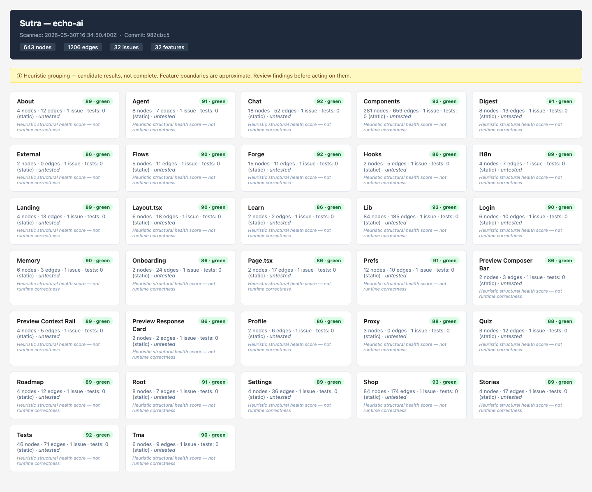

# Sutra

Static structural graph tool for JavaScript / TypeScript and **Frappe / Python** repositories. Points at a repo, produces a structural flow graph (`graph.json`) and a local HTML view. **v1.1.0** — Phases 0–7 complete + incremental scan cache.



> The interactive feature viewer (`forge-sutra viewer`) on a live echo-ai scan — 643 nodes, 1,206 edges, 32 features. Health-scored feature cards, search, health/confidence filters, and Overview / Ecosystem tabs. Click any card for its drill-down (traced flows, nodes, endpoints, issues).

## Vision

> **See your product as features — derived from code, not from docs, and honest about what it doesn't know.**

- **Truthful by default.** Every finding is labelled *candidate* until it's actually confirmed (cross-repo, dynamic routes, and external hosts resolved). No "finds all bugs", no overstated claims — structural/contract drift only.
- **Features, not files.** The unit is a *feature*: what it is, what it wires to, whether the wiring is intact, and where it's broken — with a health score you can click into.
- **A realistic feature viewer.** An interactive local viewer — feature cards, request-flow drill-down, a cross-repo map, and live refresh on code change — so you learn something true-and-new about your codebase in seconds.

## Roadmap

Full plan (4 epics, 23 stories, sequencing, and Definition of Done) lives here:
**[`_bmad/ROADMAP.md`](https://github.com/sbknext/forge-sutra/blob/main/_bmad/ROADMAP.md)**
· browse every story in the **[plan index](https://github.com/sbknext/forge-sutra/blob/main/_bmad/README.md)**.

- **Epic 1 — Truthful Graph:** external-host allowlist, dynamic-route matcher, confidence model, cross-repo linking, incremental scan, scan diff.
- **Epic 2 — Real Features:** feature contracts, client↔server reconciliation, AI inference, health score, flow tracing, test-coverage mapping.
- **Epic 3 — Realistic Feature Viewer ⭐:** viewer app, feature cards, drill-down, cross-repo map, live/watch, search & share.
- **Epic 4 — Ecosystem & SDK:** language-agnostic core, Python/Frappe extractor, Forge SDK extraction, CI integration, graph history.

**Try it:** `forge-sutra scan /path/to/repo && forge-sutra view` — then watch the roadmap as the static view grows into the full feature viewer. Issues and PRs welcome.

## Install

Primary npm bin: **`forge-sutra`**. Optional alias: **`sutra`** (same entry point).

```bash
npm install -g forge-sutra
# or from source:
npm run build && npm link
```


## Commands

All commands work via `forge-sutra` or `sutra`. Examples below use `forge-sutra`.

### `forge-sutra scan [repoPath]`

Scans `repoPath` (defaults to current working directory). Resolves to an absolute path.

Produces `.sutra/graph.json` in the current working directory. Re-scans use a content-hashed per-file cache at `.sutra/cache/` (git-ignored); delete it to force a full re-parse. The scan summary prints `N cached · M parsed` when the cache is active.

```
forge-sutra scan /path/to/my-repo
forge-sutra scan   # uses cwd
sutra scan         # alias — same command
```

Options:
- `--watch` — debounced re-scan on TS/JS file changes (CLI-only; for live viewer use `watch` command). Snapshots previous graph to `.sutra/graph.prev.json`, writes `.sutra/diff.json`, prints delta summary. Ctrl+C to stop. Static scan only — not a runtime monitor.
- `--profile` — print phase timings (walk, parse, checks, write) to stderr. Candidate timings only — environment-dependent, not an SLA.
- `--ai` — opt-in LLM feature naming (`ai_name` / `ai_summary` on features). Requires `SUTRA_AI_API_KEY`. Offline/no-key scans fall back to heuristic labels.
- `--check` — compare scan to baseline graph; exit **1** if new error-severity issues vs baseline (drift gate, not absolute state). Exit **2** if baseline missing or graph version mismatch.
- `--baseline <path>` — baseline for `--check` (default: `.sutra/baseline.json`).
- `--fail-on <severity>` — gate threshold: `error` (default), `warn`, or `info`.
- `--format json` — machine-readable gate output (with `--check`).
- `--pr-comment [path]` — Markdown PR comment body for `--check` (stdout or file).

### `forge-sutra baseline [repoPath]`

Runs a full scan and writes `.sutra/baseline.json` for CI gating. Commit this file to pin acceptable structural state.

```
forge-sutra baseline
forge-sutra scan --check    # fails only on new issues vs baseline
```

**GitHub Actions (canonical):**

```yaml
- run: npm ci && npm run build
- run: npx forge-sutra baseline ./your-repo   # once, commit .sutra/baseline.json
- run: npx forge-sutra scan ./your-repo --check
  # exit 1 = new structural regression · exit 2 = missing/incompatible baseline
```

Exit codes for `--check`: **0** pass · **1** new issues at `--fail-on` threshold · **2** configuration error (no baseline or version skew).

What it does:
1. Walks the repo (skips `node_modules`, `dist`, `.next`, `.git`, `coverage`, `out`).
2. Parses every `.ts`, `.tsx`, `.js`, `.jsx` file with ts-morph (AST-based, never regex).
3. Emits nodes for: modules, endpoints (Next.js App Router + pages/api + Express), components, functions, handlers, tests.
4. Emits edges for: imports, calls, renders (JSX), tests (test-file → subject), http (fetch/axios).
5. Parses `feature.sutra.md` contract files when present.
6. Runs structural + contract checks (see below).
7. Groups nodes into heuristic features by directory prefix.
8. Writes `.sutra/graph.json`.
9. Prints a one-screen summary to stdout.

### `forge-sutra view`

Reads `.sutra/graph.json` written by `scan`. Produces `.sutra/view.html` (a self-contained HTML document with Mermaid diagrams and issue lists). If `.sutra/diff.json` exists, shows a "Changes since last scan" panel. Opens it in the default browser on macOS; prints the file path on other platforms.

```
forge-sutra view
```

### `forge-sutra viewer`

Starts a local HTTP server (default port **4577**, binds **127.0.0.1** only) serving an interactive SPA that reads `.sutra/graph.json` on each request. Reload the browser tab or click **Reload graph** to pick up a fresh scan — no HTML rebuild required. No auth, no multi-user, localhost-only.

```
forge-sutra viewer
forge-sutra viewer --port 4600
```

The static `forge-sutra view` command remains the offline/no-server fallback.

### `forge-sutra watch [repoPath]`

Live mode: starts the viewer SPA, runs an initial scan, then re-scans on file changes (debounced) and **pushes** the updated graph to the browser via Server-Sent Events. Binds **127.0.0.1** only. Uses incremental scan cache when available.

```
forge-sutra watch
forge-sutra watch --port 4600
```

### "Explain this feature" (AI — live viewer only)

Click any feature card in the drill-down panel to open it. An **Explain (AI)** button appears at the bottom of every drill-down. Clicking it calls `POST /explain/:featureId` on the viewer backend, which builds a structural prompt from the feature's node list, issue set, and health score, then streams a candid plain-English explanation back to the panel token-by-token.

**Honesty rules (mandatory):**

Every explanation is preceded by the non-removable label:

> AI explanation — derived from code structure, not from documentation. Candidate — not a complete description.

The system prompt instructs the model to say "appears to," "structurally suggests," or "candidate" when inferring intent. The model is told never to claim runtime correctness, test status, or security properties.

After the explanation, a CTA appears: **Save this explanation to Brain memory — `brain memory_save`.**

**Setup:**

```bash
# OpenAI (default)
export SUTRA_AI_API_KEY=sk-...
forge-sutra watch

# Anthropic
export SUTRA_AI_API_KEY=sk-ant-...
export SUTRA_AI_PROVIDER=anthropic
forge-sutra watch

# Model override (optional; default: gpt-4o-mini / claude-3-haiku-20240307)
export SUTRA_AI_MODEL=gpt-4o
```

**Environment variables:**

| Variable | Default | Description |
|---|---|---|
| `SUTRA_AI_API_KEY` | (required) | API key for the AI provider. Affects both `--ai` scan flag and the live Explain panel. |
| `SUTRA_AI_PROVIDER` | `openai` | Provider: `openai` or `anthropic`. AI — candidate enum, extend as needed. |
| `SUTRA_AI_MODEL` | `gpt-4o-mini` / `claude-3-haiku-20240307` | Model to use for explanations. |

**Rate limit:** 10 Explain calls per minute per running viewer instance (in-memory, not persistent across restarts). Candidate threshold — adjust based on provider costs. Excess calls return a clear "Rate limit — try again in N seconds" message.

**Static mode:** The Explain button is hidden in `forge-sutra share` artifacts (`__SUTRA_STATIC__`). AI calls require a live viewer server. The panel shows "AI explanation available in the live viewer (`forge-sutra watch`)." instead.

**Missing key:** If `SUTRA_AI_API_KEY` is not set, the Explain button is shown but clicking it returns the message "AI explanations require SUTRA_AI_API_KEY — see README" rather than a raw error.

### `forge-sutra share [repoPath]`

Scan a repo and produce a **self-contained HTML artifact** — one file, no server required, all viewer assets inlined.

```
forge-sutra share
forge-sutra share ./my-repo
forge-sutra share --out /tmp/my-graph.html
```

Output: `.sutra/share/view-<repo>-<YYYYMMDD-HHMMSS>.html`

- **Single file.** CSS, JS, and graph data all inlined. Open in any browser without installing anything.
- **Snapshot label.** Every artifact displays a `Snapshot taken: <ISO date>` header so recipients know they are looking at a point-in-time export, not a live feed.
- **Static mode.** SSE live-push, "Reload graph", and "Export view" are suppressed (`window.__SUTRA_STATIC__ = true`). The "Share this view" button becomes **"Copy local path"** — copies the local file path + URL hash (useful for passing to a teammate).
- **No API keys.** Scan runs in the same masking context as the normal viewer; raw secrets are never emitted to the graph.
- **AI labels survive.** If the scan was run with `--ai`, `ai_name` and `ai_summary` fields appear in the artifact with their **AI** badge.
- **Mermaid requires internet.** Feature-graph diagrams load Mermaid from CDN — the only external dependency.

**CTA printed after write:**

```
Host this file on any static server (GitHub Pages, Cloudflare Pages, Netlify)
— or give it memory: https://docs.sbknext.com/brain/install
```

**Typical size:** ~200–800 KB depending on graph size (candidate estimate — varies by repo).

**Flags:**
- `--out <path>` — override the default output location.
- `--output-dir <dir>` — write `.sutra/` artifacts here instead of `cwd`.

### Search, filter & share (viewer)

The viewer SPA supports substring search, health-band toggles, confidence threshold (elements without `confidence` show only at threshold `0`), and issue-kind filters. **Share this view** encodes filter state in the URL hash; **Export view** writes a self-contained `.sutra/view.<slug>.html` via `POST /export-view`.

### `forge-sutra diff [pathA] [pathB]`

Diff two `graph.json` files. Defaults: `.sutra/graph.json` vs `.sutra/graph.prev.json`.

```
forge-sutra diff
forge-sutra diff .sutra/graph.json .sutra/graph.prev.json
forge-sutra diff graph-a.json graph-b.json --out .sutra/diff.json
```

Output: structured JSON (nodes/edges/issues added/removed/changed) + human counts line. Structural delta only — does not explain why code changed.

### `forge-sutra scaffold [--from-issues <kinds>] [--force]`

Emit **candidate** test stubs from graph issues into `.sutra/scaffold/`. Each file has a `// CANDIDATE — generated by Sutra, not run automatically` banner. Never overwrites existing files without `--force`.

```
forge-sutra scaffold
forge-sutra scaffold --from-issues orphaned_endpoint
forge-sutra scaffold --from-issues contract_missing_route --force
```

Stubs may not compile. Not run in CI. Not auto-test generation.

### `forge-sutra reconcile --client <graph> --server <graph>`

Match client graph HTTP calls against server graph routes. Each `cross_repo_orphan` is classified into one of four categories so false positives from proxies, dynamic routes, and external hosts don't flood the output.

```
forge-sutra reconcile --client .sutra/all/echo-ai.json --server .sutra/all/brain-api.json

# Print all four classes with suppression reasons:
forge-sutra reconcile --client .sutra/all/echo-ai.json --server .sutra/all/brain-api.json --verbose

# Write classified JSON:
forge-sutra reconcile --client ... --server ... --out .sutra/reconcile.json
```

**Classification semantics** (honest labels — this is sutra's core principle):

| Class | Meaning |
|---|---|
| `confirmed_broken` | No static suppression rule explains the call. **Does NOT mean "definitely a bug"** — it means no proxy, dynamic-route, or external-host pattern matched. Human review needed. |
| `proxy_suppressed` | Path matches a `PROXY /prefix` node in the client graph (from `next.config` rewrite detection). Candidate only — dynamic expressions in `next.config` may be missed. |
| `dynamic_suppressed` | Path structurally matches a server route template (`[param]` or `:param`). **Structurally matched only — auth, method, and params are NOT validated.** |
| `external_suppressed` | Target host matches the external-host allowlist (`.sutra/external-hosts.json` or built-in defaults: Telegram, Stripe). |

All orphans appear in the JSON output — none are silently dropped. The viewer's "Cross-repo" panel shows `confirmed_broken` only by default; suppressed entries are accessible via "Show suppressed (N)".

Cross-repo static match only — ignores auth, env-specific URLs, runtime 404s. Results are **candidates for human review**.

### `forge-sutra migrate [graphPath]`

Migrate a saved `graph.json` to the current schema version. Default: `.sutra/graph.json`.

```
forge-sutra migrate
forge-sutra migrate .sutra/graph.json
```

Migrates **structure only** — does not re-scan or fix semantic issues.

**Version history:**

| Version | Change |
|---------|--------|
| 0 | Phase 0 schema (no `contracts` field) |
| 1 | Added `contracts[]` from `feature.sutra.md` |
| 2 | Optional `confidence` (0..1) and `provenance` on nodes, edges, issues |

When `GRAPH_VERSION` bumps, run `forge-sutra migrate` on cached graphs before diffing or viewing.

## Development

```bash
# Install dependencies
npm ci

# Compile TypeScript → dist/
npm run build

# Link the CLI locally so `forge-sutra` resolves to your build
npm link

# Run tests
npm test

# Rebuild on change (watch mode)
npm run build -- --watch
```

Type-check only (no emit): `npx tsc --noEmit`.

The main CLI entry point is `src/index.ts`; scanner logic lives under `src/scanners/`.
Graph schema and migration code are in `src/graph/`.

---

## graph.json schema

```jsonc
{
  "version": 5,           // GRAPH_VERSION constant; bump = breaking change
  "repo": "my-repo",      // basename of the scanned directory
  "scanned_at": "...",    // ISO 8601 UTC timestamp
  "commit": "abc1234",    // short git hash, or "unknown"
  "nodes": [SutraNode],
  "edges": [SutraEdge],
  "issues": [SutraIssue],
  "features": [SutraFeature],
  "contracts": [SutraContract],  // from feature.sutra.md when present
  "flows": [SutraFlow]           // ordered request paths (Story 2.5)
}
```

### SutraNode

```jsonc
{
  "id": "src/api/route.ts#GET /api/foo",  // stable deterministic: relPath#symbol
  "type": "route|handler|component|test|endpoint|module|function",
  "name": "GET /api/foo",
  "file": "src/api/route.ts",             // repo-relative POSIX path
  "line": 12,
  "data_shape": "{ id: string }",         // first param type text, or null
  "feature": "api",                        // heuristic grouping id
  "confidence": 0.9,                       // optional 0..1; absent = unknown
  "provenance": "ast-exact"                // optional; see Provenance below
}
```

**Provenance values:** `ast-exact` (AST-resolved, no guessing), `heuristic` (directory/name inference), `template-prefix` (truncated template literal URL), `ai-inferred` (LLM-produced, never asserted as fact).

### SutraEdge

```jsonc
{
  "from": "src/components/Foo.tsx",
  "to":   "http:POST /api/bar",           // or a node id, or "ext:react"
  "kind": "calls|imports|renders|tests|http",
  "confidence": 0.9,                      // optional
  "provenance": "ast-exact"               // optional
}
```

### SutraIssue

```jsonc
{
  "severity": "error|warn|info",
  "kind": "orphaned_endpoint|missing_handler|dangling_test_ref|contract_parse_error|contract_missing_route|contract_undeclared_route|cross_repo_orphan",
  "node": "POST /api/bar",               // the thing in question
  "feature": "components",              // heuristic feature tag
  "message": "Client calls POST /api/bar but no route handler defines it.",
  "confidence": 0.4,                    // optional
  "provenance": "template-prefix"       // optional
}
```

### SutraFeature

```jsonc
{
  "id": "components",
  "label": "Components",
  "node_ids": ["..."],
  "issue_count": 3,
  "health": {
    "score": 72,
    "band": "amber",
    "inputs": [ ... ],
    "available_signals": ["issue_load", "orphan_ratio"]
  },
  "label_source": "heuristic",   // or "ai-inferred" when scan --ai succeeds
  "ai_name": "Authentication",   // optional; display only when ai-inferred
  "ai_summary": "Login and OTP." // optional; one line, length-capped
}
```

### Feature health (heuristic)

Each feature carries a **heuristic structural health score** (0–100) with band `green` / `amber` / `red`. This is derived from code structure (issue load, orphan ratio, and optional signals when available) — **not** runtime correctness or test pass/fail. The viewer labels this explicitly so it is never read as a bug-free guarantee.

### SutraFlow

```jsonc
{
  "id": "flow:app/widget/page.tsx#WidgetPage",
  "entry": "app/widget/page.tsx#WidgetPage",
  "steps": [
    { "node": "app/widget/page.tsx#WidgetPage", "edge": null },
    { "node": "components/WidgetButton.tsx#WidgetButton", "edge": { "from": "...", "to": "...", "kind": "renders" } }
  ],
  "terminal": "db|handler|external|unresolved|truncated",
  "confidence": "confirmed|candidate"
}
```

Request flows are **code-derived paths** from entry (route/component) through renders/calls/http hops. Unresolved or dynamic-segment http targets are labelled `candidate`, not confirmed.

---

## Structural checks

| Kind | What it catches |
|------|----------------|
| `orphaned_endpoint` | A `fetch`/`axios` call targets a METHOD+path that no endpoint node covers. |
| `missing_handler` | An imports/calls/renders edge references a local symbol or file that has no node in the graph. |
| `dangling_test_ref` | A test file imports a module that no longer exists in the repo. |
| `contract_parse_error` | `feature.sutra.md` could not be parsed (warn, non-fatal). |
| `contract_missing_route` | Declared endpoint in contract has no matching route in graph (error). |
| `contract_undeclared_route` | Route exists but not declared in contract when contract file present (warn). |
| `cross_repo_orphan` | Client graph HTTP call has no matching route in server graph (warn, via `reconcile`). |
| `untested_feature` | No confirmed `tests` edge resolves into the feature (info). **Static presence only — not runtime/line coverage.** |

---

## Claim Bounds

Sutra is a **static, heuristic approximation**. Read this before acting on any finding.

- **Structural / contract mistakes only.** Sutra finds missing routes, dead imports, orphaned fetch calls, and contract drift. It does NOT find logic bugs, runtime errors, security issues, or performance problems.
- **Candidate results, not complete.** Dynamic imports, aliased imports, runtime-generated routes, and unresolved template-literal concatenation may produce false positives or misses.
- **Static approximation.** No code is executed. No type inference beyond what ts-morph surfaces.
- **Not auto-debug / auto-test.** Sutra does not fix code, run tests, or validate runtime behavior. Scaffold output is candidate stubs only.
- **Test linkage is static, not coverage.** `test_edge_count` / `tested` count confirmed `tests` edges in the graph. They do NOT measure line coverage, branch coverage, or test pass/fail.

Known limitations:
- **External hosts:** Known external API hosts (Telegram, Stripe, etc.) are suppressed via allowlist + optional `.sutra/external-hosts.json`. Unknown external hosts may still false-positive.
- **Proxy rewrites:** Client-side `next.config` rewrites are detected as PROXY nodes and suppress local `orphaned_endpoint`. Cross-repo reconcile does not automatically map proxy prefixes to server routes — verify manually.
- **Dynamic routes:** Template-literal fetches are matched against `[param]` / `:param` routes structurally. Method correctness, auth, and param types are not validated.
- **Contracts:** `feature.sutra.md` is author-declared intent, not ground truth. Undeclared routes are warn-only when a contract file exists.
- **CSS/asset imports:** Non-JS/TS import targets are ignored in `missing_handler` checks.
- **Express variable mounts:** Routers mounted via variable (e.g., `app.use(prefix, router)`) may not resolve the full path correctly.
- **Frappe / Python (Epic 4.2):** `@frappe.whitelist()` → endpoints, DocType controllers → handlers, `hooks.py` `doc_events` / `scheduler_events` → edges. Same candidate/heuristic standard as TS. Dynamically-built dotted paths, `frappe.get_attr()` / `frappe.call()`, and runtime-overridden hooks are not confirmed.
